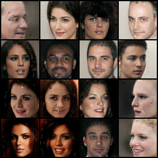
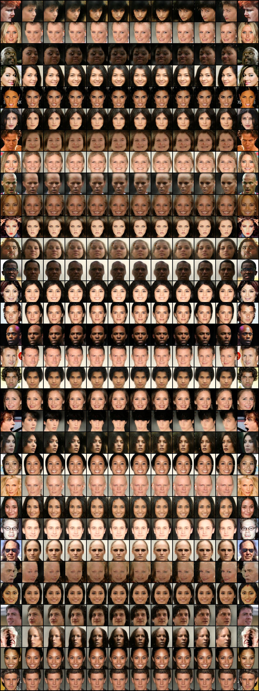

# py-began-master

This is a Boundary Equailibrium GAN(BEGAN) for image generation.[paper](https://arxiv.org/abs/1703.10717)

## Dependences
* [tensorflow](https://www.tensorflow.org/)
* opencv
* tqdm

## Usage

We use CelebA dataset for training, at training state, you should run
```bash
python main.py --data_dir DATA_DIR
```

At the testing/interpolating step, there are three types for image interpolation:
* mode1: using one image, interpolate between it and its mirror image(horizontal flip image)
* mode2: using two images
* mode3: using CelebA images, no inputs
For mode1:
```bash
python main.py --mode 1 --image1 IMAGE1_PTH
```
For mode2:
```bash
python main.py --mode 2 --image1 IMAGE1_PTH --image2 IMAGE2_PTH
```
For mode3:
```bash
python main.py --mode 3
```

## demo
### BEGAN samples(300k iterations, 64 image scale)


### BEGAN interpolation(2000 interp iterations)

=======
